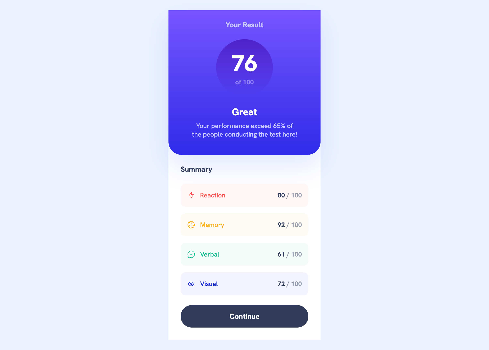

# Results summary component

## 介紹

這是 Frontend Mentor 上名為《[Results summary component](https://www.frontendmentor.io/challenges/results-summary-component-CE_K6s0maV) 》的挑戰。藉由這個挑戰提供的 Figma 設計稿來練習切版、RWD 的能力。

## 使用技術

- 進階：React、Tailwind CSS、TypeScript、Vite
- 基礎：HTML、CSS、JavaScript

## 專案預覽圖

### 桌面版（1440px）

### 手機版（375px）

## 學習筆記

### Tailwind CSS 自定義斷點

在 `tailwind.config.js` 中，我特別加入了一些自定義的斷點，像是 `mobile`（375px） 和 `desktop`（1440px）。這主要是因為 Tailwind CSS 的內建斷點（例如：`sm`（640px）、`md`（768px）、`lg`（1024px）、`xl`（1280px））並不符合我的需求。另外，這些自定義的斷點名稱也更加直觀，方便我在開發過程中使用。

### linear-gradient（線性漸層）

`background-image: linear-gradient(to 目標方向, 起始顏色, 結束顏色);`
